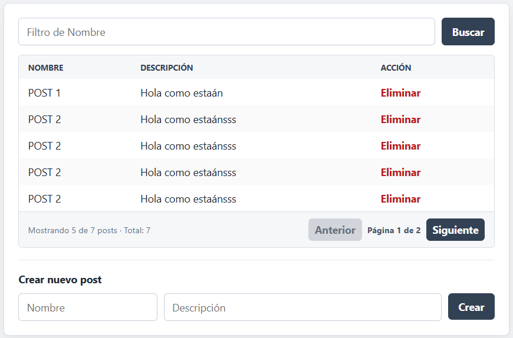

# Posts App

Aplicación full stack para la administración de posts.

Este proyecto fue desarrollado como parte de un challenge técnico, integrando un frontend en **React** con **Redux** y un backend en **FastAPI** conectado a **PostgreSQL**.

La aplicación permite crear, listar, eliminar y filtrar posts de forma local desde la interfaz.

## Vista previa



---

## Objetivo del proyecto

Construir una aplicación simple pero bien organizada, separando responsabilidades entre frontend y backend.

El frontend se encarga de la experiencia de usuario, gestión de estado y filtrado local de información.
El backend expone una API REST para la persistencia y administración de posts.

---

## Tecnologías utilizadas

### Frontend

* React
* Vite
* Redux
* JavaScript
* PNPM

### Backend

* Python
* FastAPI
* SQLAlchemy
* PostgreSQL
* Docker Compose
* Pydantic

---

## Estructura del proyecto

```txt
posts-app/
│
├── backend/    API REST con FastAPI y PostgreSQL
│
└── frontend/   Aplicación React con Redux
```

Cada carpeta contiene su propio README con instrucciones específicas de instalación, configuración y ejecución.

---

## Funcionalidades principales

* Crear posts.
* Listar posts.
* Eliminar posts.
* Filtrar posts por nombre localmente.
* Consumir una API REST desde React.
* Persistir datos en PostgreSQL.
* Administrar el estado del frontend con Redux.

---

## Punto clave del challenge

La lista completa de posts debe solicitarse al backend solo una vez cuando carga la vista principal.

Después de esa carga inicial, los posts quedan almacenados en Redux y el filtro por nombre se aplica localmente sobre el estado del frontend, sin volver a solicitar toda la lista al backend.

Esta decisión reduce llamadas innecesarias a la API y demuestra un manejo eficiente del estado en el frontend.

---

## Flujo general de la aplicación

1. El backend se conecta a PostgreSQL.
2. La API expone endpoints para crear, listar y eliminar posts.
3. El frontend carga la vista principal.
4. Al iniciar, React solicita la lista de posts mediante `GET /posts`.
5. Los posts recibidos se almacenan en Redux.
6. La interfaz renderiza los posts desde el estado global.
7. El filtro se aplica localmente sobre los datos ya cargados.
8. Las acciones de crear y eliminar sincronizan la información con el backend.

---

## Endpoints principales

```txt
GET     /health             Verifica el estado de la API
GET     /posts              Lista todos los posts
POST    /posts              Crea un nuevo post
DELETE  /posts/{post_id}    Elimina un post por ID
```

---

## Ejecución local

Para evitar duplicar instrucciones, este README solo muestra el orden recomendado de arranque.
Los comandos detallados están documentados en cada módulo.

| Paso | Qué levantar | Instrucciones |
|------|--------------|---------------|
| 1 | PostgreSQL | [Levantar PostgreSQL](backend/README.md#levantar-postgresql) |
| 2 | Backend FastAPI | [Instalación local](backend/README.md#instalación-local), [variables de entorno](backend/README.md#variables-de-entorno) y [ejecutar la API](backend/README.md#ejecutar-la-api) |
| 3 | Frontend React | [Variables de entorno](frontend/README.md#variables-de-entorno), [instalación local](frontend/README.md#instalación-local) y [levantar el frontend](frontend/README.md#levantar-el-frontend) |

URLs locales por defecto:

```txt
Backend:  http://localhost:8000
Frontend: http://localhost:5173
```

---

## Consideraciones de desarrollo

Si el frontend no logra conectarse con el backend, revisar que:

* El backend esté ejecutándose.
* PostgreSQL esté levantado.
* Las variables de entorno estén correctamente configuradas.
* La URL `VITE_API_URL` apunte al backend.
* No existan errores de CORS.

---

## Decisiones de arquitectura

El proyecto separa claramente las responsabilidades entre frontend y backend.

En el backend, la lógica se organiza en rutas, esquemas, modelos, servicios y configuración de base de datos.

En el frontend, se utiliza una estructura por `feature`, agrupando todo lo relacionado con posts en un mismo módulo: estado Redux, llamadas a la API y componentes.

Esta organización permite que el proyecto sea más fácil de mantener, probar y extender.

---
